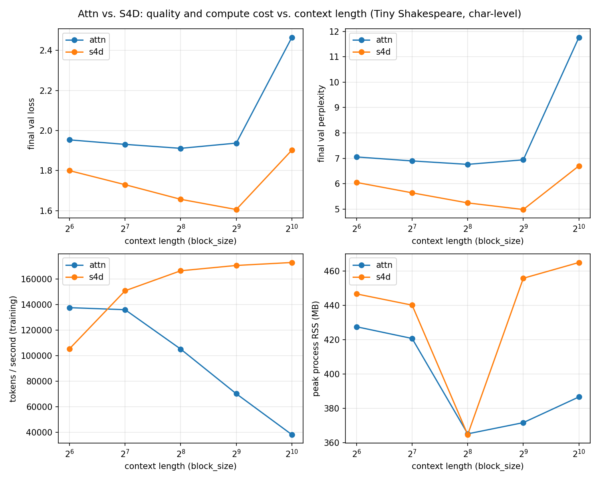

# S4D vs. Transformer: a controlled sequence-architecture comparison

A from-scratch PyTorch implementation of a diagonal structured state space model (S4D, from Gu,
Gupta, Goel, Ré, arXiv:2206.11893) and a controlled, apples-to-apples-as-possible comparison against a
from-scratch causal Transformer (reusing the causal-attention implementation from the author's
[nano-gpt](https://github.com/AdebanjiAdelowo/nano-gpt)) on character-level language modeling, across
context lengths from 64 to 1024.

This is a research project, not a demo: the goal was scientific correctness and an honest account of
what was and wasn't controlled, not a flattering headline number. See `experiments.md` for the full
limitations list before quoting any result from this repository.

## Motivation

Deep-learning state space models (SSMs) share their core recurrence with the state-space
representations used in classical control theory: both are built on the continuous-time form
$x'(t) = Ax(t) + Bu(t)$ and its discretized recurrence (see `architecture.md` Section 1). This
project implements S4D from scratch and compares it against a causal Transformer under matched
training conditions, as a controlled empirical study of a non-Transformer sequence architecture.

## What's in this repo

- **`architecture.md`**: the math, with every claim tagged `[LIT]` (from the cited papers),
  `[IMPL]` (a choice this repo makes), or `[HYP]` (tested empirically, not assumed).
- **`src/s4d.py`**: the S4D layer, with convolutional (training) and recurrent (step) views.
- **`src/model.py`**: a shared backbone with a swappable mixer (`attn` or `s4d`); everything else
  (embeddings, MLP, norm placement, weight tying) held identical between the two.
- **`src/train.py`**, **`src/data.py`**: shared, instrumented training loop and data pipeline.
- **`tests/`**: numerical validation (recurrent vs. convolutional equivalence, stability
  constraint, S4D-Lin init check) and backbone sanity checks. **11/11 passing.**
- **`experiments/`**: the context-length sweep and the plotting/table-generation script.
- **`experiments.md`**: results, interpretation, and limitations (read before citing any number).

## Headline result (read the caveats in `experiments.md` first)

Across context lengths 64–1024, on char-level Tiny Shakespeare, with the *same* optimizer, LR
schedule, batch size, seed, and model depth/width for both mixers (see `experiments.md` for exactly
what was and wasn't controlled): S4D reached lower validation loss than the Transformer at every
context length tested, and became substantially cheaper per token as context length grew (at
block_size=1024: ~172.9k vs. ~38.2k training tokens/second). This is **not** presented as "S4D
beats Transformers" in general; see `experiments.md`'s Limitations section for why (no
hyperparameter tuning per architecture, a ~12% parameter-count mismatch, single dataset/seed/scale).



## Numerical validation (the part that has to be right before any of the above means anything)

`tests/test_s4d_numerics.py` checks that the training-time convolutional kernel (materialized via
the Vandermonde formula, S4D eq. 7) and the step-by-step recurrence (`x_t = Ā x_{t-1} + B̄ u_t`)
compute the same function, both at initialization and after an optimizer step: measured max
absolute difference ~9e-8 to ~2.4e-6 across the tested configurations (float32 precision, four
`h_dim`/`n_state`/length/batch/seed combinations including a post-optimizer-step check), not
assumed equal. The test prints the actual max/mean absolute difference per configuration; reproduce
with `pytest tests/test_s4d_numerics.py -v -s -k recurrent_matches_convolutional`.

```bash
pip install -r requirements.txt
pytest tests/ -v
```

## Reproducing the experiments

```bash
python experiments/run_context_length_sweep.py   # ~20 min on Apple M-series (MPS)
python experiments/make_plots.py
```

## Primary sources

- Gu, Gupta, Goel, Ré. *"On the Parameterization and Initialization of Diagonal State Space
  Models."* arXiv:2206.11893 (NeurIPS 2022): the paper this repository implements.
- Gu, Goel, Ré. *"Efficiently Modeling Long Sequences with Structured State Spaces."* ICLR 2022
  (arXiv:2111.00396): background only (HiPPO-LegS, DPLR), not implemented here.

## What this project is not

Not a Mamba/selective-SSM implementation, not a large-scale or multi-GPU training result, not a
parameter-matched study, and not a claim of state-of-the-art anything. See `experiments.md`.

## Remaining Work

A possible extension is adding a from-scratch Mamba (selective-SSM) mixer to this controlled
comparison harness. Not yet started; flagged risk is that no MPS/CUDA-kernel-free implementation
of Mamba's selective scan matches official throughput on Apple Silicon, so any resulting
three-way throughput comparison would need heavy caveating. Portfolio-wide project status is
tracked centrally in the author's Selected Projects documentation; this project's status there is
DEFERRED RESEARCH.
