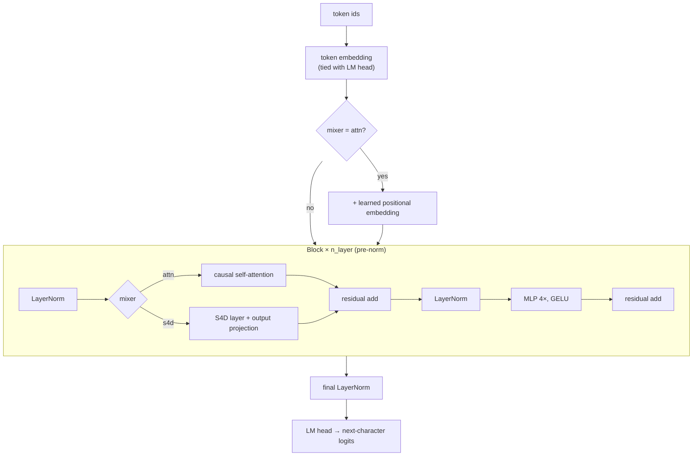
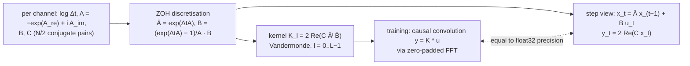
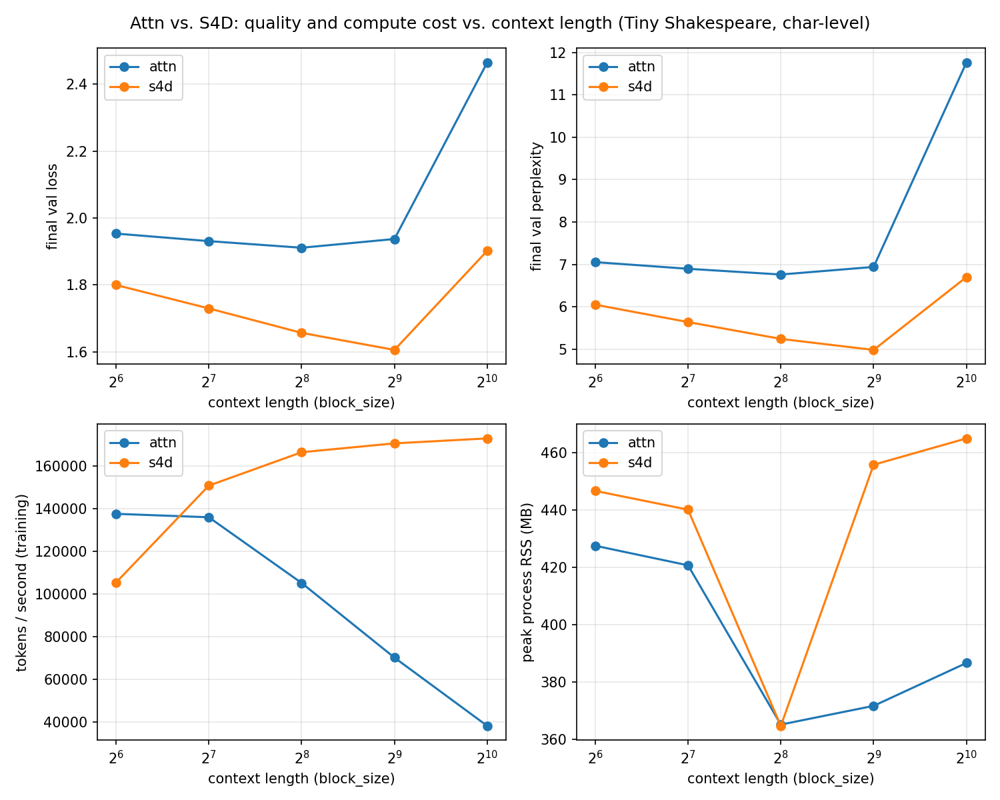
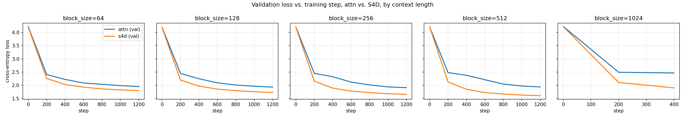

# S4D vs. Transformer: a controlled sequence-architecture comparison

A from-scratch PyTorch implementation of a diagonal structured state space model (S4D, from Gu,
Gupta, Goel, Ré, arXiv:2206.11893) and a controlled, apples-to-apples-as-possible comparison against a
from-scratch causal Transformer (reusing the causal-attention implementation from the author's
[nano-gpt](https://github.com/AdebanjiAdelowo/nano-gpt)) on character-level language modeling, across
context lengths from 64 to 1024.

`experiments.md` states exactly what was and was not controlled; read its limitations list before
quoting any result from this repository.

## Motivation

Deep-learning state space models (SSMs) share their core recurrence with the state-space
representations used in classical control theory: both are built on the continuous-time form
$x'(t) = Ax(t) + Bu(t)$ and its discretized recurrence (see `architecture.md` Section 1). This
project implements S4D from scratch and compares it against a causal Transformer under matched
training conditions, as a controlled empirical study of a non-Transformer sequence architecture.

## What's in this repo

- **`architecture.md`**: the math, with every claim tagged `[LIT]` (from the cited papers),
  `[IMPL]` (a choice this repo makes), or `[HYP]` (tested empirically, not assumed).
- **`src/s4d.py`**: the S4D layer, with convolutional (training) and recurrent (step) views.
- **`src/model.py`**: a shared backbone with a swappable mixer (`attn` or `s4d`); everything else
  (embeddings, MLP, norm placement, weight tying) held identical between the two.
- **`src/train.py`**, **`src/data.py`**: shared, instrumented training loop and data pipeline.
- **`tests/`**: numerical validation (recurrent vs. convolutional equivalence, stability
  constraint, S4D-Lin init check) and backbone sanity checks. **11/11 passing.**
- **`experiments/`**: the context-length sweep and the plotting/table-generation script.
- **`experiments.md`**: results, interpretation, and limitations (read before citing any number).

The shared backbone (`src/model.py`). Only the mixer and the learned positional embedding differ
between the two models; the S4D model has no positional embedding because the convolution kernel
already depends on position:


```mermaid
flowchart TD
    T["token ids"] --> E["token embedding<br/>(tied with LM head)"]
    E --> PE{"mixer = attn?"}
    PE -->|yes| POS["+ learned positional embedding"]
    PE -->|no| BL
    POS --> BL
    subgraph BL["Block × n_layer (pre-norm)"]
        LN1["LayerNorm"] --> MX{"mixer"}
        MX -->|attn| AT["causal self-attention"]
        MX -->|s4d| S4["S4D layer + output projection"]
        AT --> R1["residual add"]
        S4 --> R1
        R1 --> LN2["LayerNorm"] --> MLP["MLP 4×, GELU"] --> R2["residual add"]
    end
    BL --> LNF["final LayerNorm"] --> H["LM head → next-character logits"]
```

Inside the S4D layer (`src/s4d.py`) the same linear state-space model is evaluated in two ways;
`tests/test_s4d_numerics.py` checks that they agree:


```mermaid
flowchart LR
    P["per channel: log Δt, A = −exp(A_re) + i A_im,<br/>B, C (N/2 conjugate pairs)"] --> Z["ZOH discretisation<br/>Ā = exp(ΔtA), B̄ = (exp(ΔtA) − 1)/A · B"]
    Z --> K["kernel K_l = 2 Re(C Āˡ B̄)<br/>Vandermonde, l = 0..L−1"]
    K --> CV["training: causal convolution y = K * u<br/>via zero-padded FFT"]
    Z --> RC["step view: x_t = Ā x_(t−1) + B̄ u_t<br/>y_t = 2 Re(C x_t)"]
    CV <-.equal to float32 precision.-> RC
```

## Headline result (Apple MPS; read the caveats in `experiments.md` first)

Across context lengths 64–1024, on char-level Tiny Shakespeare, with the *same* optimizer, LR
schedule, batch size, seed, and model depth/width for both mixers (see `experiments.md` for exactly
what was and wasn't controlled): after a fixed budget of 1,200 training steps (400 at
block_size=1024), S4D reached lower validation loss than the Transformer at every context length
tested, and became substantially cheaper per token as context length grew (at block_size=1024:
~172.9k vs. ~38.2k training tokens/second on Apple MPS, 4.5x; at block_size=64 S4D is slower,
~105k vs. ~138k). The attention mixer is a plain implementation (explicit softmax over the full
score matrix, no fused kernel), so the throughput ratio is specific to this implementation and
device. Neither model is trained to convergence, and the result does not show that S4D is better
than Transformers in general; see `experiments.md`'s Limitations section (no hyperparameter
tuning per architecture, a ~12% parameter-count mismatch, single dataset/seed/scale).





*Validation loss against step for each context length. The block_size = 1024 runs use 400
iterations instead of 1,200 for both mixers, so compare the two mixers within a panel, not across
panels (see `experiments.md`).*

A separate sweep of the same experiment on an NVIDIA Tesla T4 (CUDA) is recorded as its own
hardware dataset in [`results/cuda/`](results/cuda/), with its environment, results table and
caveats in the "NVIDIA CUDA experiment: Tesla T4" section of [`experiments.md`](experiments.md).
The numbers above remain the Apple MPS measurements.

## Numerical validation

`tests/test_s4d_numerics.py` checks that the training-time convolutional kernel (materialized via
the Vandermonde formula, S4D eq. 7) and the step-by-step recurrence (`x_t = Ā x_{t-1} + B̄ u_t`)
compute the same function, both at initialization and after an optimizer step: measured max
absolute difference ~9e-8 to ~2.4e-6 across the tested configurations (float32 precision, four
`h_dim`/`n_state`/length/batch/seed combinations including a post-optimizer-step check), not
assumed equal. The test prints the actual max/mean absolute difference per configuration; reproduce
with `pytest tests/test_s4d_numerics.py -v -s -k recurrent_matches_convolutional`.

```bash
pip install -r requirements.txt
pytest tests/ -v
```

## Reproducing the experiments

```bash
python experiments/run_context_length_sweep.py --device mps   # ~20 min on Apple M-series, writes results/mps/
python experiments/make_plots.py --results_dir results/mps      # figures and table for that sweep
```

New sweeps are written to `results/<device>/`, separate from the recorded MPS results in
`results/*.json` (which `python experiments/make_plots.py` without arguments plots into
`figures/`). See `REMOTE_GPU.md` for device selection (`--device cpu|mps|cuda`), a Colab notebook
for NVIDIA GPUs, and the timing and memory definitions.

## Primary sources

- Gu, Gupta, Goel, Ré. *"On the Parameterization and Initialization of Diagonal State Space
  Models."* arXiv:2206.11893 (NeurIPS 2022): the paper this repository implements.
- Gu, Goel, Ré. *"Efficiently Modeling Long Sequences with Structured State Spaces."* ICLR 2022
  (arXiv:2111.00396): background only (HiPPO-LegS, DPLR), not implemented here.

## What this project is not

Not a Mamba/selective-SSM implementation, not a large-scale or multi-GPU training result, not a
parameter-matched study, and not a claim of state-of-the-art anything. See `experiments.md`.

## Possible Extensions

Adding a from-scratch Mamba (selective-SSM) mixer to this controlled comparison harness. A
three-way throughput comparison would need heavy caveating, since no MPS/CUDA-kernel-free
implementation of Mamba's selective scan matches official throughput on Apple Silicon.
