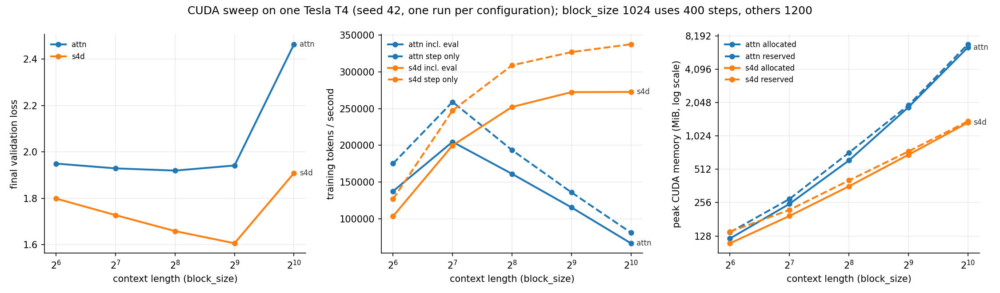

# Experiments

## Task and data

Character-level language modeling on Tiny Shakespeare (same corpus and 90/10 train/val split as
the author's `nano-gpt` repository), predicting the next character given a context window.
Cross-entropy loss is the training objective, so `exp(val_loss)` is the standard definition of
perplexity, not an approximation (see `src/train.py`).

## What is held fixed across both mixers (controlled variables)

`n_layer=4`, `n_embd=128`, `batch_size=32`, `AdamW` (`lr=1e-3`, cosine decay to `1e-4` after a
100-step warmup, weight decay `0.1`), gradient clipping at `1.0`, same random seed (`42`, so both
mixers see the same batch sequence), same eval protocol (40 batches each for train/val, every 200
steps). See `architecture.md` Section 7 for the full backbone diagram.

## What is *not* held fixed (documented, not hidden)

- **Parameter count**: attn = 0.802M (excl. positional embeddings), s4d = 0.702M, a ~12% mismatch.
  This comes from the mixer's internal structure (attention's `c_attn` packs Q/K/V into one
  `3*n_embd^2` matrix; S4D's parameter count is `O(H*n_state)`, far smaller per layer at this
  width), not from an attempt to equalize or hide the difference. A parameter-matched rerun (e.g.
  larger `s4d_state`, or an extra S4D layer) is listed as future work, not attempted here.
- **Positional embedding**: attention gets a learned `wpe` table; S4D does not need one (the
  recurrence is inherently ordered), see `architecture.md` Section 7.
- **Iteration budget at block_size=1024**: `max_iters=400` there vs. `1200` at every other context
  length, purely to keep wall-clock time on a single laptop GPU (Apple MPS) reasonable. This means
  the **cross-mixer** comparison at block_size=1024 (attn vs. s4d, both at 400 iters) is still
  controlled and valid; but the **cross-context-length** comparison of absolute final loss (e.g.
  "is bs=1024 worse than bs=512 for the same mixer") is confounded by the shorter schedule and is
  **not** a claim this project makes.

## Results

Full machine-readable results: `results/*_bs*.json` (one file per run). Summary:

| mixer | block_size | max_iters | params (excl. pos. embed) | final val loss | val ppl | tokens/s | peak RSS (MB) |
|---|---:|---:|---:|---:|---:|---:|---:|
| attn | 64   | 1200 | 0.802M | 1.9535 | 7.05  | 137,575 | 427.5 |
| s4d  | 64   | 1200 | 0.702M | 1.7999 | 6.05  | 105,365 | 446.7 |
| attn | 128  | 1200 | 0.802M | 1.9310 | 6.90  | 135,961 | 420.7 |
| s4d  | 128  | 1200 | 0.702M | 1.7298 | 5.64  | 150,795 | 440.1 |
| attn | 256  | 1200 | 0.802M | 1.9112 | 6.76  | 105,146 | 365.1 |
| s4d  | 256  | 1200 | 0.702M | 1.6567 | 5.24  | 166,443 | 364.6 |
| attn | 512  | 1200 | 0.802M | 1.9373 | 6.94  | 70,179  | 371.6 |
| s4d  | 512  | 1200 | 0.702M | 1.6057 | 4.98  | 170,603 | 455.8 |
| attn | 1024 | 400  | 0.802M | 2.4652 | 11.77 | 38,170  | 386.6 |
| s4d  | 1024 | 400  | 0.702M | 1.9022 | 6.70  | 172,923 | 465.0 |

(Regenerable exactly via `python experiments/make_plots.py`, which reads only the JSON files above;
`results/summary_table.md` is the auto-generated version of this table.)

Figures: `figures/loss_curves.png` (val loss vs. step, one panel per context length),
`figures/scaling.png` (loss / perplexity / throughput / peak memory vs. context length, log-2 x-axis).

## Interpretation

1. **Throughput crossover.** At block_size=64, attention is *faster* per token than S4D
   (137.6k vs. 105.4k tok/s); the FFT-based convolution has fixed overhead that dominates at very
   short sequences. The crossover happens between block_size=64 and 128: from 256 onward, S4D is
   faster, and the gap widens sharply (at 1024: 172.9k vs. 38.2k tok/s, ~4.5x). This is the
   qualitative pattern the literature predicts (attention is `O(L^2)`, the FFT-based diagonal-SSM
   convolution is `O(L log L)`, architecture.md Section 3.2); this project did not independently
   re-derive the asymptotic complexity, it verified the *behavioral consequence* of it empirically.

2. **Validation loss.** At every context length tested, this S4D configuration reached a *lower*
   validation loss than the attention configuration under the *same* iteration budget (e.g. at
   block_size=512: 1.606 vs. 1.937). **This is not evidence that S4D "beats" Transformers in
   general**, see Limitations below for the specific reasons this comparison cannot support that
   claim. It is only evidence that, in this small-model/short-training/single-dataset regime with
   neither architecture's hyperparameters separately tuned, S4D converged faster per optimizer step.

3. **Peak memory** is noisy and close between the two mixers at every context length tested (both
   in the 365-465 MB range, whole-process RSS); this project's memory measurement (see Limitations)
   is too coarse to support a strong claim about memory *scaling* with context length from this data
   alone, even though the throughput/timing data are much cleaner.

## Limitations (stated, not hidden)

- **No hyperparameter tuning per architecture.** Both mixers used the *same* learning rate, warmup,
  weight decay, and batch size. It is well documented in the literature that Transformers and SSMs
  can have different optimal learning rates and warmup schedules; this project did not sweep either
  separately. The loss gap in Result 2 above could partly or wholly be a learning-rate-mismatch
  artifact rather than an architectural one.
- **Parameter-count mismatch** (0.802M vs. 0.702M, ~12% fewer for S4D), see "What is not held
  fixed" above. A smaller model reaching a lower loss is, if anything, a point in S4D's favor here,
  but it also means this is not an apples-to-apples parameter-matched study.
- **Single dataset, single seed, single model scale.** One character-level corpus (~1MB), one
  random seed, one (small) model width/depth. No claim here generalizes to other data modalities,
  larger scale, or different depths/widths without further experiments.
- **No large-scale or multi-GPU training.** Everything above ran on a single Apple Silicon laptop
  GPU (MPS backend). This project makes no claim about distributed-training behavior, and the
  memory instrumentation is correspondingly coarse (see `src/train.py`'s `"memory"."note"` field:
  MPS-side peak allocation is *sampled* only at eval checkpoints, not tracked continuously the way
  CUDA's `max_memory_allocated()` does; reported peak RSS numbers are a lower bound, not an exact
  peak).
- **S4D-Lin only.** S4D-Inv (the paper's other proposed initialization, closer to true HiPPO-LegS
  at finite state size and the better performer on the paper's own Long Range Arena benchmark, see
  architecture.md Section 5) was not implemented or compared here.
- **No generation/step-mode benchmarking.** `S4DLayer.step()` exists and is verified correct
  (`tests/test_s4d_numerics.py`) but no experiment here measures autoregressive generation latency;
  only teacher-forced training throughput was measured.
- **Not a Mamba/selective-SSM comparison.** This project implements S4D (a *linear time-invariant*
  diagonal SSM), not Mamba's input-dependent selective-scan mechanism. No claim is made about how
  these results would transfer to a selective SSM.

## NVIDIA CUDA experiment: Tesla T4

The same context-length sweep was repeated on an NVIDIA GPU as a separate hardware dataset. The
results above, and the README headline, remain the Apple MPS measurements. The CUDA files are in
`results/cuda/`, and nothing in the MPS dataset was changed.

**Environment** (from `results/cuda/environment.json` and each result's `device_info`): one Tesla T4
(NVIDIA driver 580.82), PyTorch 2.11.0+cu130, CUDA 13.0, cuDNN 9.27, Python 3.13, source commit
`117ab7957c0a7e48a9d9070012f5bb3827827738`, run on Google Colab with `colab/run_cuda.ipynb`. Every
scientific setting (model, optimizer, schedule, batch size, step counts, eval protocol, seed 42)
is identical to the corresponding MPS run. There is one run per configuration.

| mixer | block_size | max_iters | final val loss (CUDA) | final val loss (MPS, historical) | `tokens_per_second` | `train_step_tokens_per_second` | peak CUDA allocated (MiB) | peak CUDA reserved (MiB) |
|---|---:|---:|---:|---:|---:|---:|---:|---:|
| attn | 64 | 1200 | 1.9501 | 1.9535 | 137,785 | 175,362 | 121 | 138 |
| s4d | 64 | 1200 | 1.7991 | 1.7999 | 103,839 | 127,128 | 110 | 140 |
| attn | 128 | 1200 | 1.9295 | 1.9310 | 204,813 | 259,044 | 249 | 276 |
| s4d | 128 | 1200 | 1.7278 | 1.7298 | 199,931 | 247,456 | 194 | 220 |
| attn | 256 | 1200 | 1.9200 | 1.9112 | 161,320 | 193,626 | 615 | 722 |
| s4d | 256 | 1200 | 1.6590 | 1.6567 | 252,186 | 308,748 | 359 | 406 |
| attn | 512 | 1200 | 1.9419 | 1.9373 | 115,774 | 136,185 | 1,860 | 1,936 |
| s4d | 512 | 1200 | 1.6066 | 1.6057 | 272,328 | 326,700 | 692 | 742 |
| attn | 1024 | 400 | 2.4645 | 2.4652 | 67,054 | 81,480 | 6,455 | 6,892 |
| s4d | 1024 | 400 | 1.9092 | 1.9022 | 272,579 | 337,329 | 1,349 | 1,390 |

The two throughput columns measure different things:

- `tokens_per_second` uses the same definition as the MPS table. It is end-to-end, including
  periodic evaluation, CPU batch assembly and host-to-device copies.
- `train_step_tokens_per_second` counts only the synchronized optimizer steps.

Definitions are in `REMOTE_GPU.md`.



*`results/cuda/cuda_scaling.png`, generated by `python experiments/plot_cuda_results.py`. Per-step
validation curves are in `results/cuda/loss_curves.png`. The generic `make_plots.py` scaling figure
is not included for CUDA. Its peak-RSS panel is roughly flat at about 1.2 GB, mostly CUDA runtime
overhead, and its narrow axis makes differences of a few MB look large.*

Observations from this one Tesla T4 run:

1. **Validation loss matches MPS closely.** Corresponding CUDA and MPS final validation losses
   differ by at most 0.0088 (absolute). Exact equality is not expected. Model initialisation and the
   training-batch sequence are the same on both backends, but dropout masks come from
   backend-specific random generators, and floating-point reduction order differs between the
   CUDA and Metal kernels. S4D reaches lower final validation loss than attention at every
   context length on CUDA as well.
2. **Within-T4 throughput.** Attention has the higher measured `tokens_per_second` at
   block_size 64. The two are close at 128 (204.8k vs. 199.9k). S4D is higher from 256 through
   1024. At block_size 1024 the measured end-to-end throughput is about 272.6k tokens/s for S4D
   and 67.1k for attention. These numbers describe this implementation on this GPU in this run.
   They are not a general ranking of the two architectures.
3. **CUDA memory.** From block_size 64 to 1024, peak CUDA allocated memory grows from about 121 to
   6,455 MiB for attention and from about 110 to 1,349 MiB for S4D. The allocator-reserved peak
   follows the same pattern. These are exact allocator peaks over the training loop
   (`torch.cuda.max_memory_allocated()` / `max_memory_reserved()`). They are much more informative
   about device-memory scaling than the MPS data, which only samples current allocation at eval
   checkpoints (a lower bound) alongside whole-process RSS. The two memory APIs measure different
   quantities, so the CUDA figures should not be compared numerically with the MPS memory
   sample.

Caveats specific to this dataset:

- One run per configuration, one seed (42), one Tesla T4. There are no error bars.
- Throughput varies between runs: re-running MPS configurations on the original Mac changed
  `tokens_per_second` by about 25% while final losses agreed to about 4e-7. No CUDA-vs-MPS speedup should be
  inferred from the two tables.
- The `nvidia-smi` snapshot stored in `environment.json` was taken just after the sweep finished.
  It reports 74°C at 32 W idle. GPU temperature and clocks during the sweep were not recorded, so
  thermal state may have affected timing. Whether throttling occurred is not established.
- Peak process RSS in `results/cuda/summary_table.md` mostly reflects CUDA and runtime overhead in
  host memory. It is not evidence of how model memory scales.

## Reproduction

```bash
pip install -r requirements.txt
pytest tests/ -v                                   # numerical and device/output tests
python experiments/run_context_length_sweep.py --device mps   # full sweep, ~20 min on Apple M-series, writes results/mps/
python experiments/make_plots.py --results_dir results/mps      # figures and table for that sweep
python experiments/make_plots.py                    # regenerates figures/ and results/summary_table.md from the recorded results/*.json
python experiments/plot_cuda_results.py             # regenerates results/cuda/cuda_scaling.png from the recorded CUDA results
```

Other devices (CPU, NVIDIA CUDA, Colab) and the timing and memory definitions are described in
`REMOTE_GPU.md`.
